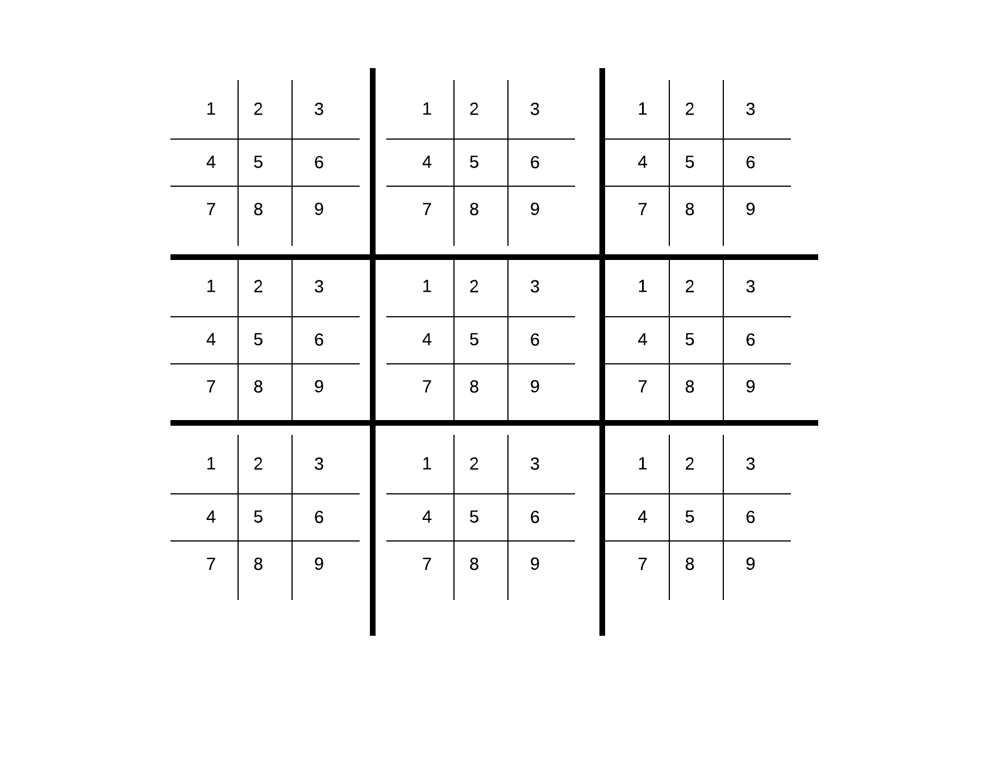

# HyperTic-Tac-Toe
The classic game Tic-Tac-Toe made of 9 more Tic-Tac-Toe and  exciting new rules that make it a brand new strategy game.

The original Tic-Tac-Toe is a game played in a 3 x 3 board, each cell could be listed from 1 to 9. This version of the game is a extended version with a big board composed by  9 smaller 3 x 3 boards of the original Tic-Tac-Toe, each board could be listed to from 1 to 9 as follows:

## Game rules
The basic rules of classic Tic-Tac-Toe still apply, that is:

* A player must play with and **O** and a second player with and **X**.

* The first player who manages to align 3 **O** or 3 **X** in a vertical, horizontal or diagonal line, wins.

### New rules added in this game:

* The first player decides what board to play in and in which cell. The second player must play in the board that corresponds to the cell selected by the first player. For example, if player 1 puts a O in the cell 2 of the central board, the player 2 must play in any position of the positions of the board 2.

* If a board is completed, that is, if a player wins in the board following the classic rules, the board is now locked .

* If a player has to play in a locked cell, that player can choose any of the non-locked boards to play his move.

* If any board is declared as a draw, the previous rule will applies the same (it becomes a locked board).

* The player who manages to win 3 boards in a row filling the with **O** or **X** in a vertical, horizontal or diagonal line, wins. (That is, for example, winning the board 1, 3 and 9)
